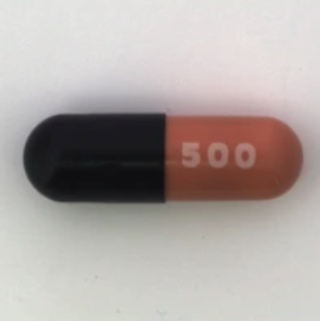
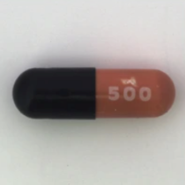

# Captic-technisch-luik

## Technisch luik

Schrijf een python scriptje waar je een bestandsnaam van een afbeelding kan aan meegeven.
Het script gaat dan voor die afbeeldingen een JSON-file uitschrijven met de metadata van de afbeelding.
Gebruik hierbij de opencv package.

Dockerize het script zodat je een container hebt met de functionaliteit zoals hierboven beschreven.
Probeer te vermijden dat de afbeelding in de container image zelf zit.

Gedurende de test verwachten we dat je gebruik maakt van GitHub.
Met deze test willen we nagaan of je Python, Docker en GitHub beheerst.
Daarnaast kijken we ook naar je manier van werken en de kwaliteit van de code.

## Solution technisch luik

Commands needed to build and run the docker container:

```console
docker build -t my_container .

docker run -v /path/to/external/file:/app/external_file -v /path/to/output/directory:/app/output my_container
```

Commands i used to run the docker container:

```console
docker build -t metadata .

docker run -v "C:\Users\maxit\Documents\HOGent\3e Jaar\Stage\Captic-technisch-luik\images\pil1.png":/app/external_file -v "C:\Users\maxit\Documents\HOGent\3e Jaar\Stage\Captic-technisch-luik\output":/app/output metadata
```

## Inzichtelijk luik

Maak een README aan in de waarin je in het kort beschrijft hoe je te werk om een dataset te clusteren.

Veronderstel dat de dataset bestaat uit afbeeldingen zoals:
  en  

Verschillen zijn dus minimaal.
Het doel van het clusteren is om uiteindelijk te bepalen welke types defecten er allemaal kunnen voorkomen.
Je weet dus niet op voorhand hoeveel clusters je mag verwachten.

Bonuspunten:

Het kan zeker geen kwaad om onze andere stageopdracht eens door te sturen mocht je vrienden hebben in het traject "Mobile & Enterprise Developer".
